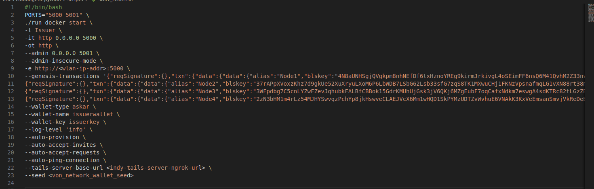

# Integration of Hyperledger Aries & Indy with Hyperledger Fabric-CA

This project focuses on the integration of Hyperledger Indy and Hyperledger Aries with Hyperledger Fabric to enhance the identity management and secure communication capabilities of the Fabric blockchain network. The primary objective is to leverage the decentralized identity (DID) and verifiable credentials (VC) features provided by Indy and Aries to generate Certificate Authority (CA) certificates for Fabric. These certificates are then utilized by Hyperledger Fabric to authenticate and authorize network participants, ensuring secure and efficient communication within the blockchain ecosystem.

# Tech Stack Used

- Node.js 
- Hyperledger Aries
- Hyperledger Indy
- Hyperledger Fabric
- Openssl

# Prerequisites
 
- Ubuntu (20.04)
- Curl
- Docker
- Docker-compose
- Node.js (20.13.1 or above)
- Npm (10.5.2 or above)
- Ngrok Auth-token
- Von-network
- Indy-tails-server
- Aries-cloud-agent Python
- Hyperledger Fabric

# Installation of Prerequisites

## Curl

Open new terminal

```bash 
sudo apt update
sudo apt install curl -y
```
## Docker

```bash
curl -fsSL https://get.docker.com -o get-docker.sh
chmod +x get-docker.sh
./get-docker.sh
rm get-docker.sh
```
To enable properly use the docker command without using sudo, execute the below command

``` sudo usermod -aG docker $USER ```

**Restart your laptop**

## Docker-compose

```bash
sudo curl -L "https://github.com/docker/compose/releases/download/1.29.2/docker-compose-$(uname -s)-$(uname -m)" -o /usr/local/bin/docker-compose
sudo chmod +x /usr/local/bin/docker-compose
```
## Node.js
```bash
curl -fsSL https://deb.nodesource.com/setup_20.x -o nodesource_setup.sh
sudo -E bash nodesource_setup.sh
sudo apt-get install -y nodejs
```
**Verifying Installation**
```bash
node -v
npm -v
```
## Von-network
```bash
git clone https://github.com/bcgov/von-network.git
cd von-network
chmod a+w ./server/
./manage build
```
## Indy-tails-server
- Go to (https://ngrok.com/)
- Do Sign up if you didn't have account or Login if you have account already
- Navigate to Account Dashboard
- Select **Your Authtoken** option and copy Authtoken

Then 
```bash
git clone https://github.com/bcgov/indy-tails-server.git
cd indy-tails-server
cd docker
echo NGROK_AUTHTOKEN=COPIED_NGROK_AUTHTOKEN > .env
```
## Aries-cloud-agent Python
```bash
git clone https://github.com/hyperledger/aries-cloudagent-python.git
```
Then copy [start_issuer.sh](./scripts/start_issuer.sh) and [start_holder.sh](./scripts/start_holder.sh) to **./aries-cloudagent-python/scripts**

## Hyperledger Fabric

```bash
curl -sSLO https://raw.githubusercontent.com/hyperledger/fabric/main/scripts/install-fabric.sh && chmod +x install-fabric.sh
./install-fabric.sh -f '2.5.3' -c '1.5.6'
sudo cp fabric-samples/bin/* /usr/local/bin
```
Then [Download](./Fabric-network.zip) Fabric-network.zip in the repository and unzip it.

# Steps for Running

## Start Von-network
Open new terminal and execute below commands

```bash
cd von-network/
./manage start --logs
```
- Wait for 2 minutes to completely start the von-network
- Open web browser and navigate to **localhost:9000/**
- If you see a interface like below image that means script has executed successfully


- In right side you can see **Authenticate a New DID** section
- Enter the seed value of 32 characters or base64 character in the text box
- Click Register DID, you can able to see identity successfully registered message below and save the seed value to your prefered location


## Start Indy-tails-server
Open new terminal and execute below commands

```bash
cd indy-tails-server/docker/
./manage start                          ##You will receive error if you didn't set the NGROK_AUTHTOKEN correctly
docker logs docker-ngrok-tails-server-1
```
- Copy the Url displayed in docker logs command
- Save it in your prefered location, we will use that later


## Start Aries-cloud-agent-python
Open new terminal,then execute below commands and steps

```bash
cd aries-cloudagent-python/scripts/
```
- Open **start_issuer.sh** and **start_holder.sh** which you copied,while setting up Aries-cloud-agent
- In the **start_issuer.sh** we need to change three fields
```bash
-e http://<wlan-ip-addr>:5000 
--tails-server-base-url <indy-tails-server-ngrok-url>
--seed <von_network_wallet_seed>
```


- **wlan-ip-addr**,which is the ip address of wifi interface. You can get that by using ``ifconfig`` command
- **indy-tails-server-ngrok-url** is the url you copied while starting the indy-tails-server
- **von_network_wallet_seed** is the seed value, we registered after starting the von-network
- save **start_issuer.sh** after changing the above fields
- In the **start_holder.sh** we need to change two fields
```bash
-e http://<wlan-ip-addr>:5000 
--tails-server-base-url <indy-tails-server-ngrok-url>
```


- save **start_holder.sh** after changing the above fields
- open two terminals inside ``./aries-cloudagent-python/scripts`` folder, one is for issuer agent and another is for holder agent
- In first terminal execute ``./start_issuer.sh`` and in second terminal execute ``./start_holder.sh``

- for **start_issuer.sh**, you will see output like below


- for **start_holder.sh**, you will see output like below


## Running our project

Open new terminal,then execute below commands and steps

```bash
cd ./indy-aries-integ-with-fabric-ca
npm i
```
- navigate to ``./issuer-agent`` folder
Open another terminal and navigate to ``./indy-aries-integ-with-fabric-ca/holder-agent`` folder
- now we are going to call ``./issuer-agent`` folder terminal as **issuer-agent terminal** and ``./holder-agent`` folder terminal as **holder-agent terminal**
- In the issuer-agent terminal,run
```bash
node createInvitation.js
```

- copy the invitation which is generated as output
- navigate to ``./indy-aries-integ-with-fabric-ca/holder-agent/acceptInvitation.js`` and paste the invitation in acceptInvitation function's invitation argument and save


- In the holder-agent terminal,run
```bash
node acceptInvitation.js
```
- As a result you will output like **Connection Establishment Successful...!!**
- You can check the connection by executing ``node sendMessage.js`` in  holder-agent terminal, as a result you can able to see messages like **Hello from issuer** in start_holder.sh terminal and **Hello from holder** in start_issuer.sh terminal
- In the issuer-agent terminal, run
```bash
node createSchema.js
node genCertificate.js
node sendOffer.js
```
- In the holder-agent terminal, run
```bash
node acceptOffer.js
node fetchCred.js
```
we can able to verify the credentials which is valid or not, To do that copy the **rev_reg_id** from the output of ``node fetchCred.js`` and past that in **verifyCertificate.js** start function's ``rev_reg_id`` variable, then in the holder terminal run ``node verifyCertificate.js``

- After executing ``node fetchCred.js``, we can able to able folder named **fabric-Certificate**, inside that folder we can able to see two files which is **key.pem** & **rca.pem**, these two files used with fabric-network to start CA.

Open another terminal,this terminal will be called as **Fabric-terminal** and unzip the ``Fabric-network.zip`` ,which available in our repository folder

- copy the files in the **./indy-aries-integ-with-fabric-ca/holder-agent/fabric-Certificate** to unziped **./Fabric-network/organization/fabric-ca/org1** 

``cp ../holder-agent/fabric-certificate/* ./Fabric-network/organizations/fabric-ca/org1/
``
- There will be file called ``fabric-ca-server-config.yaml`` inside the **Fabric-network/organization/fabric-ca/org1**
-Edit line number 88 to 92 like below
```bash
name: ORG1-CA
keyfile: /etc/hyperledger/fabric-ca-server/key.pem
certfile: /etc/hyperledger/fabric-ca-server/rca.pem
```
- Then execute below command in fabric-terminal
```bash
docker-compose -f docker/docker-compose-ca.yaml up -d
```
- The command will start Fabric CA server for Org1,Org2,Orderer1
- we have modified the config file of Fabric-ca org1 so while starting the org1 CA it will take our key.pem and rca.pem as certificate and key
- Then execute

```bash
sudo chmod -R 777 organization/
./registerEnroll.sh
```
- The above command will create Client Org1,Org2,Orderer organization, then we can able to execute remaining operation in Fabric-network.

# Stopping project

## Stopping von-network

- Open the terminal that we started the von-network
- Press ``Ctrl+c``
- Execute ``./manage down`` command

## Stopping indy-tails-server

- open the terminal that we started the indy-tails-server
- Execute ``./manage down``

## Stopping Aries-cloud-agent Python

- Open issuer-agent Terminal
- Press ``Ctrl+c`` 
- Open holder-agent Terminal
- Press ``Ctrl+c``

## Optional cleaning docker cache

- Open new Terminal
- Navigate to our **./indy-aries-integ-with-fabric-ca/optional scripts/**
- Execute ``./docker_clean.sh``
